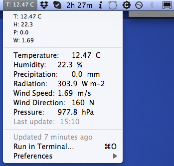

# Trento Weather BitBar Plugin
This is a plugin for BitBar (https://getbitbar.com/) that displays real-time weather data (updated every 20 mins) in your menu bar. The data is parsed from Molino Vittoria weather station hosted at University of Trento (http://www.ing.unitn.it/~prometeo/Dati.htm)

Requires Python 3 and Mac OS X (tested on 10.6.8)

See the screenshot below

